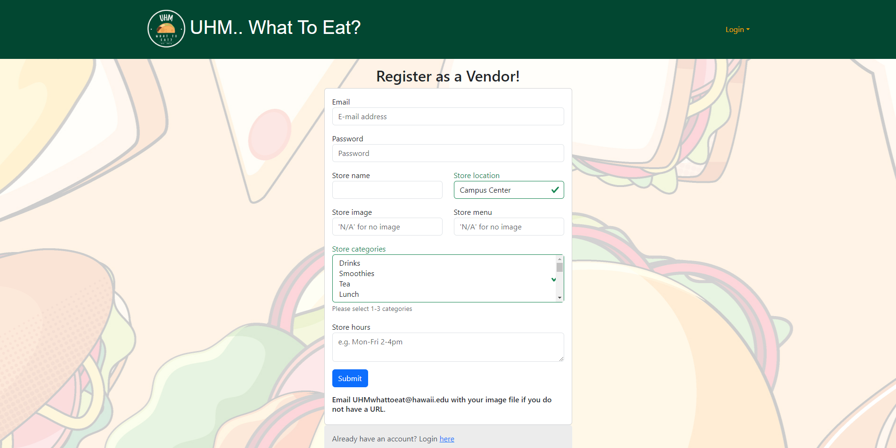
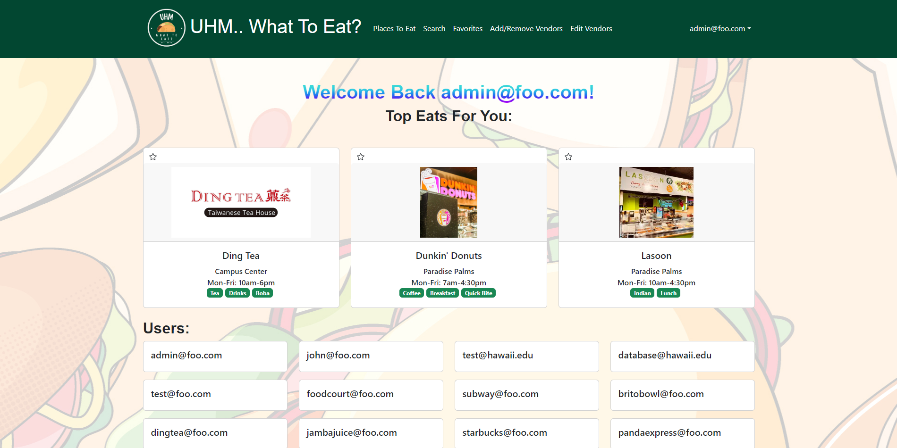

# UHM... What to eat?

## Table of contents
* [Overview](#overview)
* [Features](#features)
* [User Guide](#user-guide)
* [Community Feedback](#community-feedback)
* [Team](#team)
* [Deployment](#deployment)
* [M1](#milestone-1)
* [M2](#milestone-2)
* [M3](#milestone-3)
* [Walkthrough](#walkthrough)
* [Developer Guide](#developer-guide)

## Overview
UHM...What to eat? is a fun play on words of the University of Hawaii: Manoa's acronym, UHM, and the age-old question we ask when our stomachs grumble. UHM... What to eat? is a UH Manoa food application designed to address the diverse food choices available on campus at the University of Hawaii at Manoa. The app aims to simplify the process of finding specific menu items across various campus dining locations, including campus center, food trucks, Manoa Gardens, Paradise Palms, and more.

## Features
Roles (users, vendors, admin):
Users, who can login to see all the food vendors on the UH Manoa campus. They can view vendors based on location and can also search for vendors based on the category of food. Users can also favorite vendors of their choosing; 

Vendors, who can sign up or login to create/edit their vendor information. They can edit their store name, location, hours, vendor image, menu image, recommended items;

Admins, who also can login to administer the system. They have edit access to all vendors and can see all accounts created.

Categories: feature broad categories for vendors based on what items they sale.

Photos: supports upload of photos.

## User Guide
Getting Started:
User Registration/Login: Sign up for a new account or log in using your existing credentials.

Explore vendors at different locations on the Manoa campus. Favorite Vendors to show only the vendors you want to see. Search for specific vendors based on category tags.

Using the App:
Explore Menus: Browse through menus from various campus dining locations, organized by vendor and menu item type.

Search and Filter: Use the search and filter functionality to quickly find specific menu items or vendors.

View Availability: Check the availability of menu items in real-time and see when your favorite dishes are being served.

Manage favorites: Update your food favorites at any time to reflect your changing tastes and dietary needs.

### Vendor Features:

Login: Vendors can log in to the app to update their menu offerings for the day.

Update Menus: Vendors can add new items, remove sold-out items, or update existing menu items as needed.

Manage Profile: Vendors can also manage their profile information, including contact details and operating hours.

## Community Feedback
Person 1: 

- The search categories page could be prettier. All the categories are just in one line. Could maybe have them spaced out a bit more in different coulumns.

- Just an opinion but the Places to Eat page should default to showing all the vendors, or at least some of them rather than just being blank until a location is selected.

- Maybe combine the search and Places to Eat page.

- Like the rainbow colored font. 

- Looks pretty good overall and is honestly very usable. Could maybe change some of the fonts to make it look a little prettier instead of being one font.

Person 2:

- When using the search bar the categorical was to busy and should've been neater
I think adding a drop down option would've been a better choice

- The Fonts is kinda confusing. There were so many different fonts, which was something 
off about the website. 

- The rainbow colored font confused me but added some little different which is good. 

- The main menu was to small. The top back and the back part was smashing the middle 
menu. 

- The recommendation above the menu was a good touch. Having this makes to easier as a customer finding food that i want. 

Person 3:

- It looks good, almost professional looking.

- Easy to click on things and to use.

- Accommodating.

- Nice Design!

- Easy to access. 

Person 4: 

- Website is good cause we have places to eat split into locations and the search bar is there too in case they a looking for a specific place.
  
- The search filters are good, but would recommend a map for those who don't know the locations around manoa.
  
- "It's good cause it's simple."

Person 5:

## Team
Introducing the Culinary Crusaders of UHM – the team behind the mouthwatering magic of "UHM... What to eat?"!
* [Christian Dela Cruz](https://github.com/cdc21)
* [John Paul Alonzo](https://github.com/Johnzo1233)
* [Joshua Sato](https://github.com/joshuanssato)
* [Joshua Pedersen](https://github.com/jspedersen)
* [Spencer Wells](https://github.com/susa-s)
* [Evan Rau](https://github.com/EvanRau)
 
Join us as we redefine the campus dining experience, one delicious dish at a time. UHM... What to eat?: where food meets innovation, and every bite tells a story. Get ready to tantalize your taste buds and indulge in the ultimate dining adventure and embark on a flavor-filled voyage unlike any other!

[UHM... What to eat? Team Contract](https://docs.google.com/document/d/1LNj9PP-zLuOr3zsc3_ZD5KoFJLNKE22pDF2c1CO2s1I/edit#heading=h.hflfh83g7rog)

## Deployment 
[Digital Ocean Deployment](https://uhmwhattoeat.online/)

## Milestone 1
[M1](https://github.com/orgs/uhm-what-to-eat/projects/1)

## Milestone 2
[M2](https://github.com/orgs/uhm-what-to-eat/projects/2)

## Milestone 3
[M3](https://github.com/orgs/uhm-what-to-eat/projects/6)
## Walkthrough
A quick run through of UHM...What to eat?'s user interface. 

### Landing Page
The first thing a user or vendor sees is our landing page and quickly explains what our app is about and how to sign up/log in.


### User Sign-up Page
After clicking the sign up link on the landing page or clicking on the sign up button through the log in dropdown menu, a user may sign-up for UHM...What to eat? if they do not already have an account.


### Vendor Sign-up Page
If they are a vendor and want to sell on campus, vendors may click the vendor link on the landing page. The vendor sign-up page allows vendors to specify where their establishment is on campus, store hours, and an image. 


### Log-in Page
If one already has an account, whether user or vendor, they may click on the log-in link or the log-in button to redirect them to input their information and access their account. 


### User Landing Page
Logging into the User Account, the user is able to see all the food vendor cards on the places to eat page and manage their preferences. Each food vendor card is randommly chosen each time a user logs-in, so its a fun, foody supsrise everytime they log-in. Each food vendor card on the landing page is clickable for easy access to food vendor pages. 


### Vendor Landing Page
Logging into the Vendor Account, the vendor is able to see all food vendor(s) they own and and are able to manage and edit them.


### Admin Landing Page
Logging into the Admin Account, the admin is able to see all the users and vendors that are registered on the app. Admin is able to see all the food vendor cards on the places to eat page and manage them.


### Places To Eat Page 
If users want to see all the available options of where to eat, they may see all available establishments based on different food vendor locations on campus.


### Favorites Page
Users are also able to select their favorite restaurants from the list that will be stored in a separate webpage for their convenience.


### Admin Places To Eat Page
On the admin side, the places to eat page becomes a hub to manage food vendor cards on the places to eat page. Admin is able to add or remove food vendor cards. 


### Food Vendor Page
Users are able to see the menu items and uploaded menu image that are available at a vendor and the hours of operation.


### Admin/Vendor Menu Page
Vendors are able to manage their Recommended Items list on the menu page. They can edit existing items, add new ones, and remove old ones. Admins are able to manage the recommended items for all vendors.


### Sign Out Page
Safe Travels and Happy Eating!


## Developer Guide
* Install Meteor and  download GitHub Desktop if you have not already
* Go into the [uhm-what-to-eat/source](https://github.com/uhm-what-to-eat/source-code) github repository and click the green "Code" button and select "Open With GitHub Desktop"
* Once in GitHub Desktop, select "Clone", so our source code will be cloned to your local device
* cd into the uhm-what-to-eat/source directory and install libraries by invoking:
```
$ meteor npm install
```
* Once libraries are installed, you are then able to run the application by invoking:
```
$ meteor npm run start
```
* Once completed, click on the link prompted or navigate your way to http://localhost:3000


